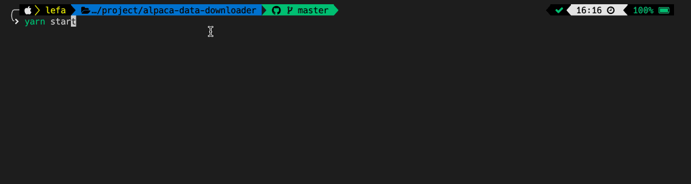

# Alpaca Data Downloader

Allows the download of market data from [Alpaca](https://alpaca.markets/) via the CLI.

Find out more about Alpaca's market data [here](https://alpaca.markets/docs/api-references/market-data-api/stock-pricing-data/historical/#bars).

## Getting Started

You'll need valid credentials from Alpaca. Once you have them, create an `.env` file and add the following:

```
ALPACA_API_KEY=<your-api-key>
ALPACA_API_SECRET=<your-api-secret>
```

To use the program, start by compiling the `.js` files:

```
yarn build
```

Then to start:

```
yarn start
```

### DEMO


